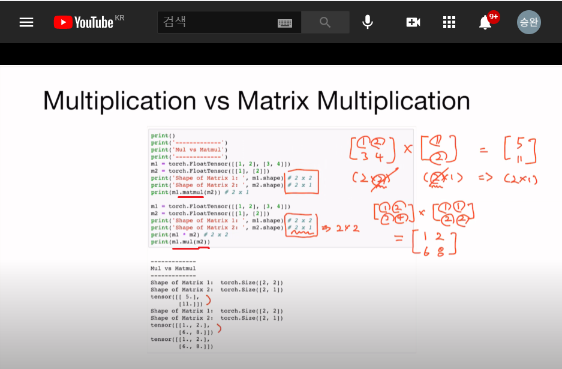
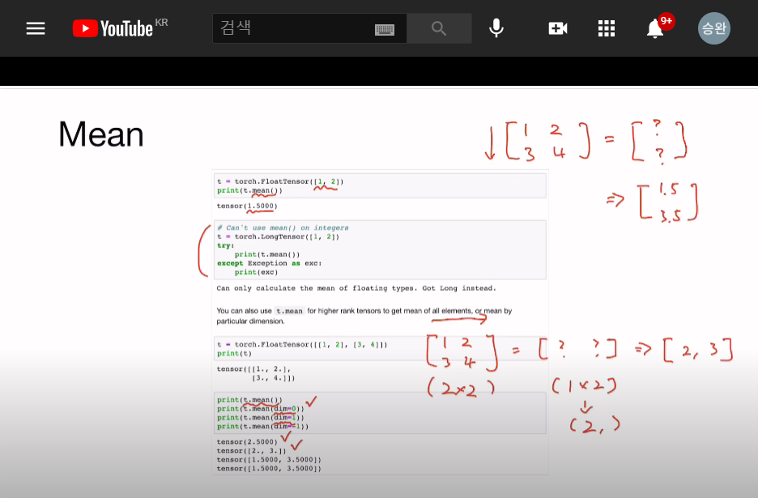
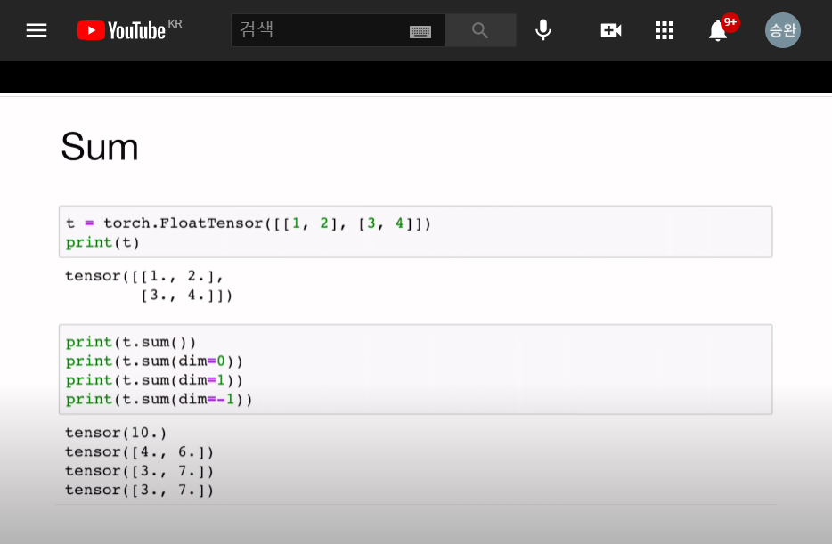
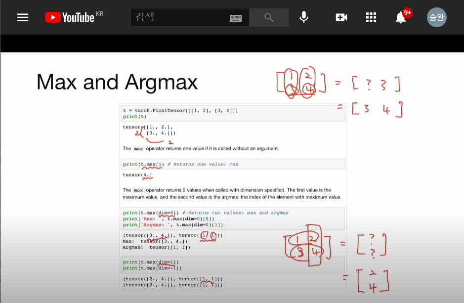

## 2021.04.04 
 + pytorch 유튜브공부
   tensor의 matrix크기를 정하는것이 중요함
   2d >> |t| = (batch size, dim ) #세로, 가로
   3d >> (Typical Computer Vision)>> |t| = (batch size, width, height ) #높이, 가로, 세로
   3d >> (Typical Natural Language Processing)>> |t| = (batch size, length, dim) #높이, 가로, 세로
   
```buildoutcfg
# 1차원 numpy
import numpy as np
import torch

t= np.array([0.,1.,2.,3.,4.,5.,6.])
print(t)

print('Rank of t : ', t.ndim)
print('Shape of t :', t.shape)

#Element 불러오기 , Slicing 도 가능
```

<br>
2d Array with Numpy 배열도 위의 예시 처럼 가능하다

```buildoutcfg
# 1차원 torch
import torch

t = torch.FloatTensor([0.,1.,2.,3.,4.,5.,6.])
print(t)
print(t.dim()) #rank
print(t.shape) #shape
print(t.size()) #shape

#Element 불러오기, Slicing 도 가능
```

<br>
2d Array with Pytorch 배열도 위의 예시 처럼 가능하다

 + Broadcasting 
   주어진 메트릭스의 사이즈를 자동으로 맞춰준다.

```buildoutcfg
# vector + vector 당연히 가능
# vector + scalar
m1 = torch.FloatTensor([1,2])
m2 = torch.FloatTensor([3])
print(m1 + m2) # m1 = (1,2) + m2 = (3,3)

# 2 x 1 vector + 1 x 2 scalar
m1 = torch.FloatTensor([[1,2]]) # 계산시에 m1 <1x2 행렬-> 2x2행렬로>
m2 = torch.FloatTensor([[3],[4]]) 계산시에 m2 <2x1 행렬-> 2x2행렬로>

print(m1 + m2)  # [[1,2],[1,2]] + [[3,3],[4,4]]
#print 결과 -> tensor([[4.,5.],[5.,6]])
```

   Broadcasting 사용시 단점 : pytorch 자체에서 바꿔서 계산하므로 추후에 오류발생시 오류를 찾기 어려울수있다.



multiplication , matrix multiplication



Mean구하기



sum구하기



Max and Argmax


